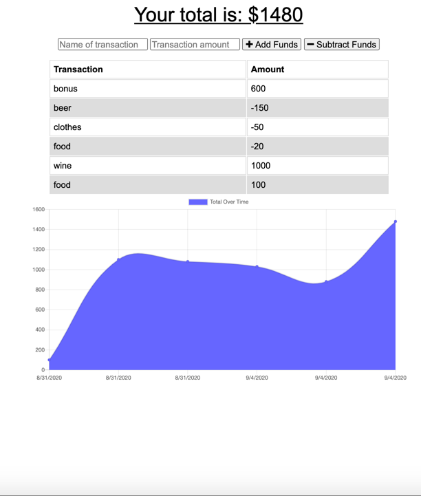

       

# Welcome to my Budget Tracker 👋

## Description

📚 `Budget Tracker` is built on an `node.js` and `express.js` stack with the purpose of allowing users to post transactions to track there money whether the app is `online` or `offline`, and the transactions syncing when back online.

## Table of Contents 🗂

* [Description](#Description)
* [Installation](#Installation)
* [Usage](#Usage)
* [License](#License)
* [Version](#Version)
* [Contributing](#Contributing)
* [Tests](#Tests)
* [Questions](#Questions)

## Installation

⚙️ use `Clone with HTTPS` and run `git clone + the HTTPS link` to install locally. Run `npm i`.

## Usage

🚨 run `node server.js` or `npm run watch` to open the app locally

View live demo <a href="https://enigmatic-cove-34274.herokuapp.com">here</a>

## License

🖋 

This app is using an MIT license

## Version

℣ 

## Contributing

👩‍💻 Please feel free to create a fork and submit a PR for review

## Tests

🧪 n/a

## Questions

❓ Feel free to create an issue for review

🌍 https://github.com/darren-behan

📧 me at darrenbehan@hotmail.com